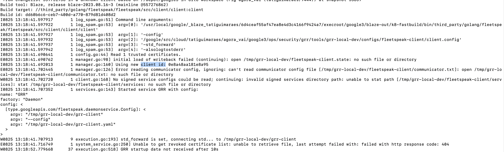
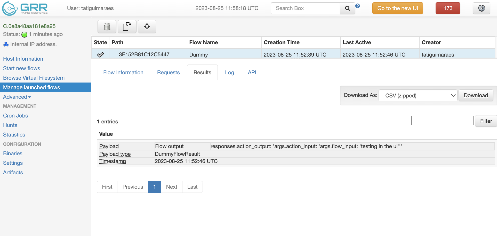

summary: How to Add a Flow
id: how-to-add-a-flow
categories: GRR
tags: GRR, Flow
status: Draft
authors: Tati, Dan
Feedback Link: https://github.com/google/grr/issues

# How to Add a Flow
<!-- ------------------------ -->
## Before you begin...
Duration: 1

This code lab assumes that you
- understand [GRR's basic concepts](https://www.grr-response.com/),
- read through [GRR's documentation](https://grr-doc.readthedocs.io/) and
- are familiar with [GRR's code base on GitHub](https://github.com/google/grr).

You can follow the [Developing GRR guide](https://grr-doc.readthedocs.io/en/latest/developing-grr/index.html) to learn what you should install on your machine and how to run GRR locally.

The code you'll be touching is mostly Python. You don't need to be an expert to follow along, but if you want more background you can check out [one of many tutorials online](https://www.w3schools.com/python/).

<!-- ------------------------ -->
## Defining the input, outputs and progress for your Flow
Duration: 5

The input and output of your Flow are its public interface. The input is provided by the user (via the API or the UI) when starting the Flow. The output is what will be provided back to them. Progress is an optional message that gives users some feedback of how much the Flow has processed so far - this is more important for Flows that take longer to process, or are running something multiple times (e.g. "collected 1 out of 10 files").

You'll need to define a ```.proto``` and an equivalent ```RDFValue``` for each. Let's go through an example.

### Writing the FlowArgs and FlowResult ```.proto```

First, write the [```.proto```](https://github.com/google/grr/blob/a903d33a9af9b1e4d31d604e073dc8c7a63fd77d/grr/proto/grr_response_proto/dummy.proto) ```messages``` for your new Flow.

<aside class="positive">
Use the <FlowName>FlowArgs as input name. This makes the link between them very obvious. For outputs, if the type of return cannot be shared (it's something specific to your action), use <FlowName>FlowResult. Examples of shared/common results are StatEntry (file metadata), BufferReference (partial file content). For the progress name, use <FlowName>Progress.
</aside>

[https://github.com/google/grr/blob/master/grr/proto/grr_response_proto/dummy.proto](https://github.com/google/grr/blob/master/grr/proto/grr_response_proto/dummy.proto)
```protobuf
message DummyArgs {
  optional string flow_input = 1;
}
message DummyFlowResult {
  optional string flow_output = 1;
}
```

### Write the FlowArgs and FlowResult ```RDFValue``` classes

Next, let's add the corresponding ```RDFValue``` [classes](https://github.com/google/grr/blob/a903d33a9af9b1e4d31d604e073dc8c7a63fd77d/grr/core/grr_response_core/lib/rdfvalues/dummy.py). They inherit from ```RDFProtoStruct```, and must have the ```protobuf``` property set. If your proto depends on other ```RDFValue```s (e.g. other protos), you should add them to the list of dependencies in ```rdf_deps``` ([example](https://github.com/google/grr/blob/a6f1b31abfe82794b7d82fa8d54d8bd94bfed1bb/grr/server/grr_response_server/gui/api_plugins/flow.py#L466C3-L466C11)).

<aside class="positive">
RDFValues are a Python class wrapper on top of Protos. At the time they were created, the Python proto library was much more limited than it is today (yes, GRR is old). RDFValues exist for legacy reasons and are still used throughout GRR's codebase.
</aside>

[https://github.com/google/grr/blob/master/grr/core/grr_response_core/lib/rdfvalues/dummy.py](https://github.com/google/grr/blob/master/grr/core/grr_response_core/lib/rdfvalues/dummy.py)
```python
class DummyArgs(rdf_structs.RDFProtoStruct):
  """Request for Dummy action."""

  protobuf = dummy_pb2.DummyArgs
  rdf_deps = []

class DummyFlowResult(rdf_structs.RDFProtoStruct):
  """Result for Dummy action."""

  protobuf = dummy_pb2.DummyFlowResult
  rdf_deps = []
```

In this case, we're defining them close to where the ```Flow``` will eventually live. It'd also be ok to define them in the same file where the Client Action ```RDFValue```s were defined (see [Adding Client Actions](../how-to-add-a-client-action/index.html)).

<!-- ------------------------ -->
## Writing the Flow class
Duration: 4

Flows are classes that inherit from [```FlowBase```](https://github.com/google/grr/blob/master/grr/server/grr_response_server/flow_base.py). The class must override:

- [```args_type```](https://github.com/google/grr/blob/a6f1b31abfe82794b7d82fa8d54d8bd94bfed1bb/grr/server/grr_response_server/flow_base.py#L151) and [```result_types```](https://github.com/google/grr/blob/a6f1b31abfe82794b7d82fa8d54d8bd94bfed1bb/grr/server/grr_response_server/flow_base.py#L171
) properties: these are the public interface for your Flow - the input provided from the user to your Flow, and what the Flow will output back to them. An important detail here is that this value must be an ```RDFValue```.
- [```Start```](https://github.com/google/grr/blob/a6f1b31abfe82794b7d82fa8d54d8bd94bfed1bb/grr/server/grr_response_server/flow_base.py#L197) method: this is the entrypoint for your Flow (the first state that will be executed). Flows are asynchronous, meaning they often do some work; then have to wait for either the Client or another Flow to do some work before they can continue. In our example Flow below, the Start method simply calls a Client Action. Then, after the Client Action finishes and all the data has been received back, GRR starts processing the ```next_state``` class method (please refer to [GRR Flows](https://grr-doc.readthedocs.io/en/latest/investigating-with-grr/flows/what-are-flows.html) for more details).

Optionally, there are some properties that can influence GRR's UI (the old and the new). In our case, we're filling these out to help us see it later:

- [```friendly_name```](https://github.com/google/grr/blob/a6f1b31abfe82794b7d82fa8d54d8bd94bfed1bb/grr/server/grr_response_server/flow_base.py#L161) is displayed as the Flow name if available.
- [```category```](https://github.com/google/grr/blob/a6f1b31abfe82794b7d82fa8d54d8bd94bfed1bb/grr/server/grr_response_server/flow_base.py#L160) is in which group of Flows it will be shown (together with others).
- [```behaviours```](https://github.com/google/grr/blob/a6f1b31abfe82794b7d82fa8d54d8bd94bfed1bb/grr/server/grr_response_server/flow_base.py#L167) is in which "user UI mode" it will be shown. Users can configure how they see the UI (basic, advanced, debug). Since we don't want this to crowd the UI unecessarily, here we're adding it to ```DEBUG```.

The [```FlowBase```](https://github.com/google/grr/blob/master/grr/server/grr_response_server/flow_base.py) base class has many other methods of interest. Here are the most important ones to be aware of:

- [```GetProgress```](https://github.com/google/grr/blob/a6f1b31abfe82794b7d82fa8d54d8bd94bfed1bb/grr/server/grr_response_server/flow_base.py#L1161): If you've defined a \<FlowName>Progress message, you can return fill it out based on partial/full data here to report it.
- [```Log```](https://github.com/google/grr/blob/a6f1b31abfe82794b7d82fa8d54d8bd94bfed1bb/grr/server/grr_response_server/flow_base.py#L711): Registers a message to the Flow Log. This is super useful for debugging, but not really read if everything goes smoothly.
- [```GetFilesArchiveMappings```](https://github.com/google/grr/blob/a6f1b31abfe82794b7d82fa8d54d8bd94bfed1bb/grr/server/grr_response_server/flow_base.py#L1170): This one is super useful for users to later download files from your Flow. If the Flow collects file contents, consider implementing this so it returns the contents of all relevant files to the user when downloading results.
- [```SendReply```](https://github.com/google/grr/blob/a6f1b31abfe82794b7d82fa8d54d8bd94bfed1bb/grr/server/grr_response_server/flow_base.py#L492): Sends a reply (output(s) of your Flow).
- [```End```](https://github.com/google/grr/blob/a6f1b31abfe82794b7d82fa8d54d8bd94bfed1bb/grr/server/grr_response_server/flow_base.py#L492): This is the last state executed by the Flow before it completes. If you need something done at the end, consider adding it here.

Whith all of that in mind, let's write our [Dummy Flow](https://github.com/google/grr/blob/master/grr/server/grr_response_server/flows/general/dummy.py). When it starts, it will simply read the input string, modify it, and send it to the Client Action. When the Client Action finishes, we'll also append to the string and return our Flow results.

[https://github.com/google/grr/blob/master/grr/server/grr_response_server/flows/general/dummy.py](https://github.com/google/grr/blob/master/grr/server/grr_response_server/flows/general/dummy.py)
```python
class Dummy(flow_base.FlowBase):
  """A mechanism to send a string to the client and back.

  Returns to parent Flow:
    A DummyFlowResult with a modified string.
  """

  friendly_name = "Dummy Example Flow"
  category = "/Administrative/"
  behaviours = flow_base.BEHAVIOUR_DEBUG

  args_type = DummyArgs
  result_types = (DummyFlowResult,)

  def Start(self):
    """Schedules the action in the client (Dummy ClientAction)."""

    if not self.args.flow_input:
      raise ValueError("args.flow_input is empty, cannot proceed!")

    request = rdf_dummy.DummyRequest(
        action_input=f"args.flow_input: '{self.args.flow_input}'"
    )
    self.CallClient(
        server_stubs.Dummy,
        request,
        next_state=self.ReceiveActionOutput.__name__,
    )

    self.Log("Finished Start.")

  def ReceiveActionOutput(
      self, responses: flow_responses.Responses[rdf_dummy.DummyResult]
  ):
    """Receives the action output and processes it."""
    # Checks the "Status" of the action, attaching information to the Flow.
    if not responses.success:
      raise flow_base.FlowError(responses.status)

    if len(responses) != 1:
      raise flow_base.FlowError(
          "Oops, something weird happened. Expected a single response, but"
          f" got {list(responses)}"
      )

    result = DummyFlowResult(
        flow_output=(
            f"responses.action_output: '{list(responses)[0].action_output}'"
        )
    )
    self.SendReply(result)

    self.Log("Finished ReceiveActionOutput.")
```

<aside class="positive">
In our example, we return a single response. In real life, you might want to send multiple responses (even of different types). You can consider this in your design, and take a look at existing Flows that do it.
</aside>

<!-- ------------------------ -->
## Writing the Flow unit tests
Duration: 5

Here's an [example test](https://github.com/google/grr/blob/master/grr/server/grr_response_server/flows/general/dummy_test.py) for our very simple Flow. We are aiming at covering the different scenarios that can happen, where things can go wrong, and what we expect to happen in these cases.

In the first test, we're testing the happy path. Here, the Flow has an input string, provides it to the mocked client, the client returns as we expect and we test the Flow result.

On the second test, we're testing the ```Start``` method argument validation. Here, it shouldn't matter which client action or mock you provide, as the client action will never be called.

The third test uses a client mock to test the ```next_state``` function, and that it fails under the right conditions.

<aside class="negative">
IMPORTANT: ALWAYS submit your tests together with the code.
</aside>

[https://github.com/google/grr/blob/master/grr/server/grr_response_server/flows/general/dummy_test.py](https://github.com/google/grr/blob/master/grr/server/grr_response_server/flows/general/dummy_test.py)
```python
# Mocks the Dummy Client Action.
class DummyActionReturnsOnce(actions.ActionPlugin):
  """Sends a single Reply (like real action would)."""

  in_rdfvalue = rdf_dummy.DummyRequest
  out_rdfvalues = [rdf_dummy.DummyResult]

  def Run(self, args: rdf_dummy.DummyRequest) -> None:
    self.SendReply(rdf_dummy.DummyResult(action_output="single"))


# Mocks the Dummy Client Action, sending two replies.
class DummyActionReturnsTwice(actions.ActionPlugin):
  """Sends more than one Reply."""

  in_rdfvalue = rdf_dummy.DummyRequest
  out_rdfvalues = [rdf_dummy.DummyResult]

  def Run(self, args: rdf_dummy.DummyRequest) -> None:
    self.SendReply(rdf_dummy.DummyResult(action_output="first"))
    self.SendReply(rdf_dummy.DummyResult(action_output="second"))


class DummyTest(flow_test_lib.FlowTestsBaseclass):
  """Test the Dummy Flow."""

  def setUp(self):
    super().setUp()
    # We need a Client where we can execute the Flow/call the Action.
    self.client_id = self.SetupClient(0)

  def testHasInput(self):
    """Test that the Dummy Flow works."""

    flow_id = flow_test_lib.TestFlowHelper(
        dummy.Dummy.__name__,
        # Uses mocked implementation.
        action_mocks.ActionMock.With({"Dummy": DummyActionReturnsOnce}),
        creator=self.test_username,
        client_id=self.client_id,
        # Flow arguments
        flow_input="batata",
    )

    results = flow_test_lib.GetFlowResults(self.client_id, flow_id)
    self.assertLen(results, 1)
    self.assertEqual(
        "responses.action_output: 'single'",
        results[0].flow_output,
    )

  def testFailsIfEmptyFlowInput(self):
    """Test that the Dummy Flow fails when there's no input."""

    with self.assertRaisesRegex(
        RuntimeError, r"args.flow_input is empty, cannot proceed!"
    ):
      flow_test_lib.TestFlowHelper(
          dummy.Dummy.__name__,
          # Should fail before calling the client
          None,
          creator=self.test_username,
          client_id=self.client_id,
          # Flow arguments are empty
      )

  def testFailsIfMultipleActionOutputs(self):
    """Test that the Dummy Flow fails when there's no input."""

    with self.assertRaisesRegex(
        RuntimeError, r".*Oops, something weird happened.*"
    ):
      flow_test_lib.TestFlowHelper(
          dummy.Dummy.__name__,
          # Uses mocked implementation.
          action_mocks.ActionMock.With({"Dummy": DummyActionReturnsTwice}),
          creator=self.test_username,
          client_id=self.client_id,
          # Flow arguments
          flow_input="banana",
      )


def main(argv):
  test_lib.main(argv)


if __name__ == "__main__":
  app.run(main)
```

<!-- ------------------------ -->
## Registering your Flow
Duration: 4

Now that we have an implemented and tested action, we can register it so it is available to be called! Hooray!

For that you need to add it to the following places.

To [```registry_init```](https://github.com/google/grr/blob/a6f1b31abfe82794b7d82fa8d54d8bd94bfed1bb/grr/server/grr_response_server/flows/general/registry_init.py#L11) to be used regularly.

[https://github.com/google/grr/blob/master/grr/server/grr_response_server/flows/general/registry_init.py](https://github.com/google/grr/blob/master/grr/server/grr_response_server/flows/general/registry_init.py)
```python
from grr_response_server.flows.general import dummy
```

To [```utils```](https://github.com/google/grr/blob/a6f1b31abfe82794b7d82fa8d54d8bd94bfed1bb/api_client/python/grr_api_client/utils.py#L27) to be used by the api client.

[https://github.com/google/grr/blob/master/api_client/python/grr_api_client/utils.py](https://github.com/google/grr/blob/master/api_client/python/grr_api_client/utils.py)
```python
from grr_response_proto import dummy_pb2
```

<!-- ------------------------ -->
## Writing the Flow end to end tests
Duration: 5

GRR also has end to end tests.

In your test functions, you can use ```RunFlowAndWait``` to run your Flow with the arguments you want, and then consult/test Flow results and other properties such as whether logs were written or not. Here's an [example end to end test](https://github.com/google/grr/blob/master/grr/test/grr_response_test/end_to_end_tests/tests/dummy.py) for our Dummy Flow.

[https://github.com/google/grr/blob/master/grr/test/grr_response_test/end_to_end_tests/tests/dummy.py](https://github.com/google/grr/blob/master/grr/test/grr_response_test/end_to_end_tests/tests/dummy.py)
```python
#!/usr/bin/env python
"""End to end tests for GRR dummy example Flow."""

from grr_response_test.end_to_end_tests import test_base


class TestDummyUnix(test_base.EndToEndTest):
  """TestDummy test."""

  platforms = [
      test_base.EndToEndTest.Platform.LINUX,
      test_base.EndToEndTest.Platform.DARWIN,
  ]

  def runTest(self):
    args = self.grr_api.types.CreateFlowArgs(flow_name="Dummy")
    args.flow_input = "abc, abc, toda criança tem que ler e escrever"
    f = self.RunFlowAndWait("Dummy", args=args)

    results = list(f.ListResults())
    self.assertTrue(results)

    self.assertIn("abc, abc, toda criança tem que ler e escrever", results)
    self.assertIn("flow_input", results)
    self.assertIn("action_input", results)
    self.assertIn("action_output", results)

    logs = "\n".join(l.log_message for l in f.ListLogs())
    self.assertIn("Finished Start.", logs)
    self.assertIn("Finished ReceiveActionOutput.", logs)

    self.assertTrue(False)


class TestDummyWindows(test_base.EndToEndTest):
  """TestDummy test for Windows."""

  platforms = [test_base.EndToEndTest.Platform.WINDOWS]

  def runTest(self):
    args = self.grr_api.types.CreateFlowArgs(flow_name="Dummy")
    args.flow_input = "abc, abc, toda criança tem que ler e escrever"
    f = self.RunFlowAndWait("Dummy", args=args)

    results = list(f.ListResults())
    self.assertTrue(results)

    self.assertIn("abc, abc, toda criança tem que ler e escrever", results)
    self.assertIn("flow_input", results)
    self.assertIn("action_input", results)
    self.assertIn("action_output", results)
    self.assertIn("WIN", results)

    logs = "\n".join(l.log_message for l in f.ListLogs())
    self.assertIn("Finished Start.", logs)
    self.assertIn("Finished ReceiveActionOutput.", logs)

    self.assertTrue(False)
```

<!-- ------------------------ -->
## ... And now to call it from a Flow!
Duration: 3

That's it, your Flow is complete! Now you can trigger it locally.

1. Make sure GRR and Fleetspeak Servers and Clients are running! See more on the [development setup page](https://grr-doc.readthedocs.io/en/latest/developing-grr/setting-up-dev-env.html).

2. Get your local Client's ID. It should show up on your client terminal. Search for ```client id```:


3. Then access your local legacy UI instance in your browser. By default, it is: [http://localhost:8081/legacy#/clients/C.<client_id_here>](http://localhost:8081/legacy#/clients/C.<client_id_here>)

4. Go to ```Start new flows```. Your Flow should be listed there.


5. After you launch it, you should be able to see the results in ```Manage launched flows```.

