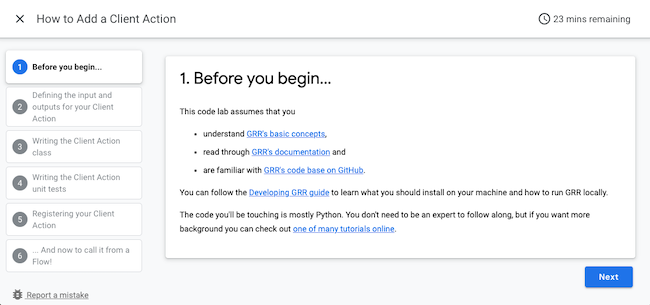
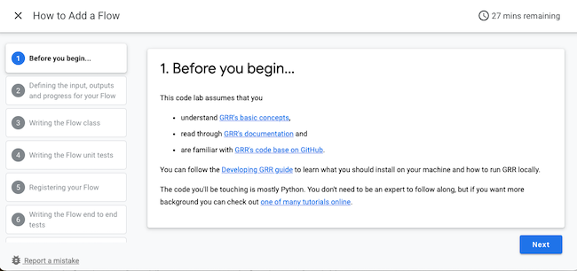

# GRR Codelabs

[Codelabs](https://github.com/googlecodelabs/tools) are interactive instructional tutorials, which can be authored in markdown syntax (or Google Docs) using some simple formatting conventions.
This doc contains the documentation and instructions you’ll need for building and publishing the GRR codelabs (and creating your own in case you choose to do so).

If you're interested in authoring codelabs, create a markdown file (or a Google Doc) following the [Codelab Formatting Guide](FORMAT-GUIDE.md) and see the online [documentation page](https://github.com/googlecodelabs/tools/blob/main/claat/README.md) on how to use the [```claat```](https://github.com/googlecodelabs/tools/blob/main/claat/README.md) command line tool.

Also, consider joining the [codelab-authors Google Group](https://groups.google.com/forum/#!forum/codelab-authors), which connects you with other authors and provides updates on new releases.

## Available GRR Codelabs

The currently available Codelabs are the following:
- [How to add a Client Action](./how-to-add-a-client-action.md), and
- [How to add a Flow](./how-to-add-a-flow.md)

## Building the GRR Codelabs

Run the ```claat``` command line tool to transform the markdown content in the Codelabs into one of the supported output formats. The default supported format is HTML. The ```claat``` tool also supports additional formats, see the [```claat``` documentation](https://github.com/googlecodelabs/tools/blob/main/claat/README.md) for more details.

```
claat export how-to-add-a-client-action.md
# The output should look like the below:
#      ok      how-to-add-a-client-action

claat export how-to-add-a-flow.md
# The output should look like the below:
#      ok      how-to-add-a-flow
```

This will create the subdirectories with a static HTML page for each of the Codelabs.

```
ls -la how-to-add-a-client-action
# The output should look like the below:
# codelab.json
# img
# index.html

ls -la how-to-add-a-flow
# The output should look like the below:
# codelab.json
# img
# index.html
```

If you're interested in altering the Codelabs then follow the instructions in the [Codelab Formatting Guide](https://github.com/googlecodelabs/tools/blob/main/FORMAT-GUIDE.md).

## Serving and accessing the GRR Codelabs

You can serve the exported Codelabs on any webserver.

However, for your convenience the ```claat``` tool also ships with a simple webserver to get you started.
Use the command below to serve the GRR Codelabs.

```
claat serve
# The output should look like the below:
# Serving codelabs on localhost:9090, opening browser tab now...
```

You can now access the Codelabs by pointing your browser to [http://localhost:9090](http://localhost:9090)

Pointing your browser to [http://localhost:9090/how-to-add-a-client-action/index.html](http://localhost:9090/how-to-add-a-client-action/index.html) should load the Client Action codelab depicted below.



When pointing your browser to [http://localhost:9090/how-to-add-a-flow/index.html](http://localhost:9090/how-to-add-a-flow/index.html) you should see the Flow codelab depicted below.


