# Setting Up a Docker Compose Development Environment

> **NOTE:** This article describes the process of setting up a GRR development environment based on Docker Compose.

## Introduction

This guide builds on the existing Docker Compose environment used for GRR.

The instructions you find here will also enable you to use the same Docker Compose setup for development purposes also.

## Step 1. Set up the Development Environment

For illustration purposes this guide follows a user journey that leverages a Code OSS (VSCode) based IDE environment bundled in container image so you can get started quickly either running it on [Google Cloud Workstations](https://cloud.google.com/workstations/docs/overview) or your own computer in case you have Docker installed.

For your convenience container image comes with all the source code and tooling preinstalled.

Follow the [instructions here](./workstation/index.md) to build and start the container image either as a Cloud Workstation or on your own computer.

Once you have the container image up and running you access the Code OSS environment in your browser.

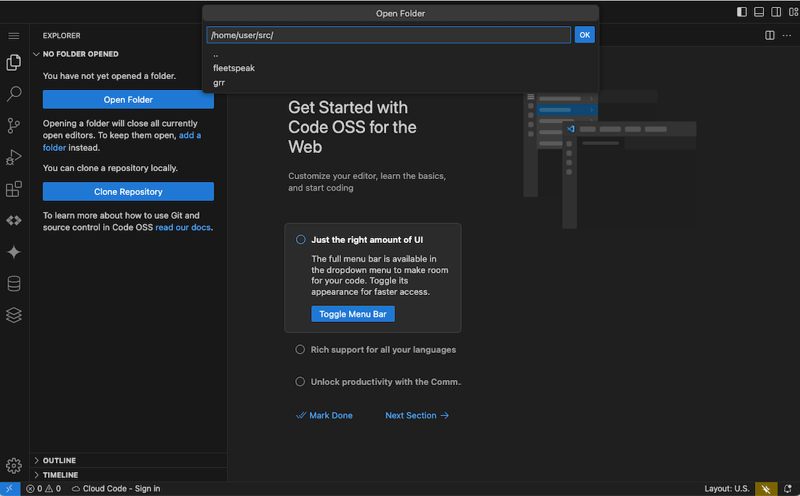

- You can now click on the Open Folder button to select ```/home/user/src/grr``` as the base directory.
- This directory contains both the grr repository pre-cloned for you.

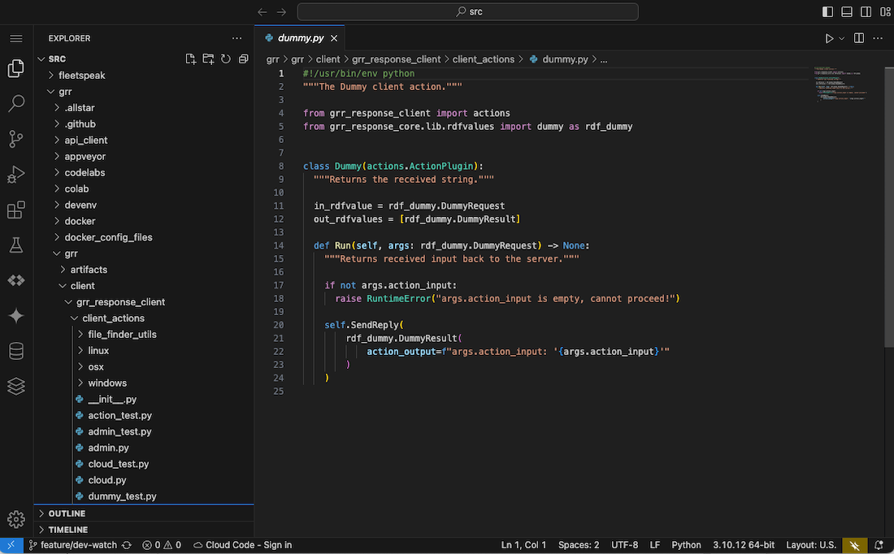

- From here you can start exploring the ```grr``` code base.
- Next we open a Terminal Panel by selecting the ```Terminal -> New Terminal``` option available from the top left menu button.

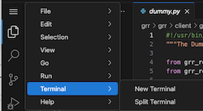

- This provides you with a Terminal Panel to execute the shell commands we will execute in the following steps.

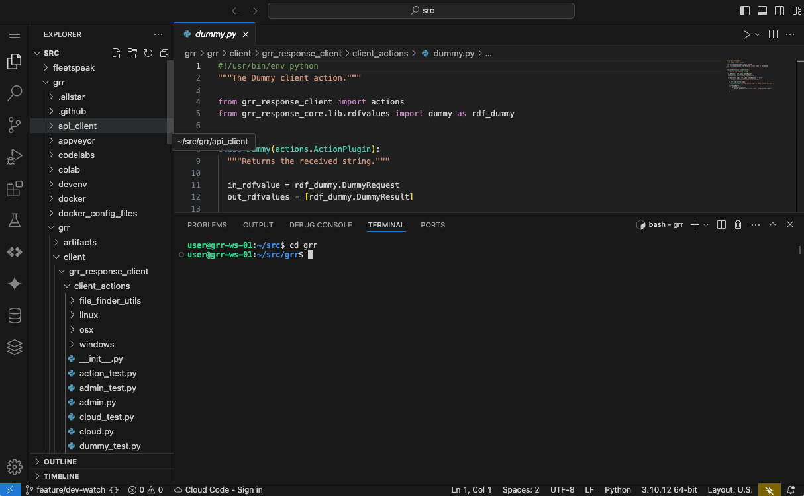

> **NOTE:** Optional: In case you choose to use your own development environment setup instead then navigate to your GRR base directory (or clone the repository if you have not done it yet):

```bash
git clone https://github.com/google/grr
cd grr/
```

## Step 2. Start GRR with Docker Compose

First we create the [certificates and keys](../installing-and-running-grr/via-docker-compose.md#generate-certificates-and-keys).

```
# This is a ONE OFF step that you only have to execute once in this IDE environment
# make sure you navigated to /home/user/src/grr first
./docker_config_files/init_certs.sh
```

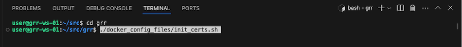

We are now ready to run GRR with the [Docker Compose stack](../installing-and-running-grr/via-docker-compose.md#generate-certificates-and-keys) by running the command below.

```
docker compose up -d
```

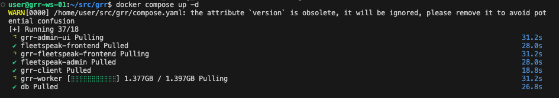

When we run this command the first time Docker has to pull all the container images. This will take a short while depending on your internet connectivity.

- Wait for Docker Compose to report that all the containers have started.
- You can then run ```docker ps``` to verify that all components started successfully.

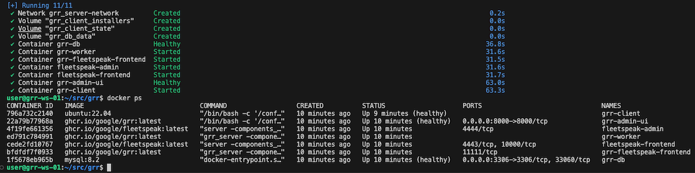


For more information you can read up on [Running in a Docker Compose Stack](../installing-and-running-grr/via-docker-compose.md).

## Step 3. Accessing GRR

With all that in place we are ready to access GRR.

You can now access GRR by either pointing your browser to [http://localhost:8000](http://localhost:8000) in case you are running the IDE container on your computer or by typing ```http://localhost:8000``` into the Terminal Panel and then ```Ctrl Click``` on it.

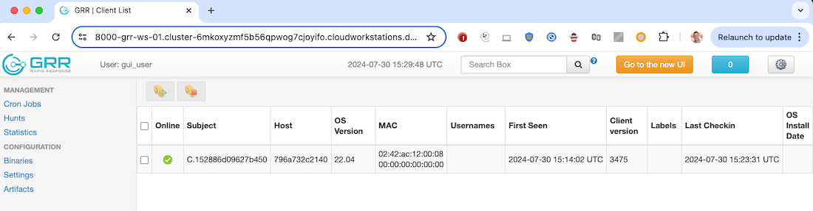


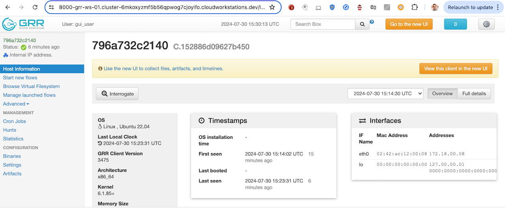

- Let's run a simple ```ListProcesses``` Flow to check the end-to-end connectivity.

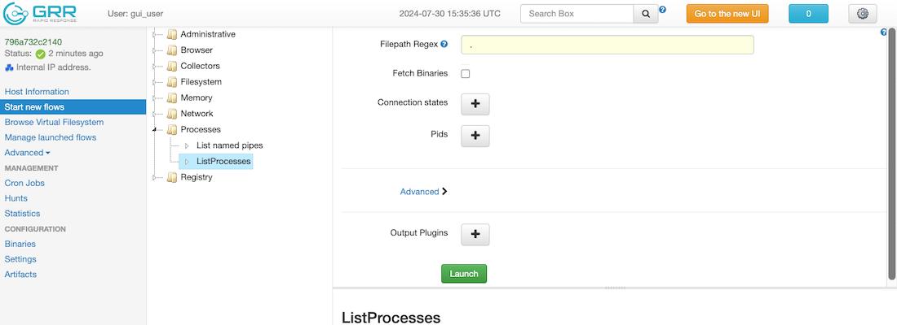

- Verify that the ```ListProcesses``` Flow completed successfully.

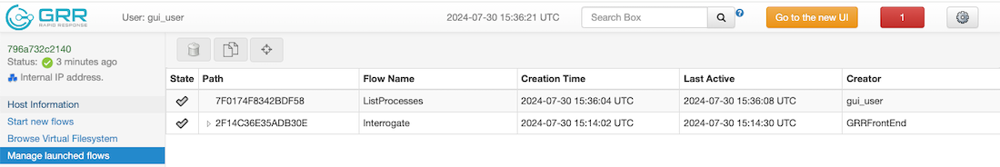

- Last but not least we switch GRR into ```Debug Mode``` by clicking on the cogwheel icon button on the top right of the screen.
- This sets us up for the development work.

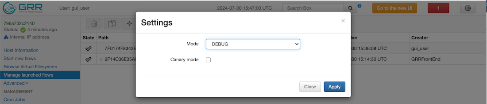

## Step 4. Development

It is now time to set up the Docker Compose stack for development.

- Go back to your Terminal Panel and type ```docker compose watch``` to start the Docker Compose stack for development.
- This will build everything from scratch and will take a couple of minutes the first time you run it.

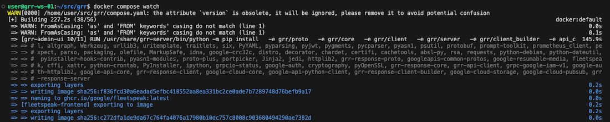

- And here we go, we are now ready to develop GRR from the IDE in our browser.

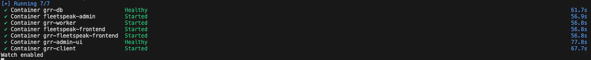

- Do any change to the GRR code base and notice how Docker Compose picks up on the changes and then propagates and applies them to the running applicaiton in the containers.
- You should see your changes being applied and going live within seconds.

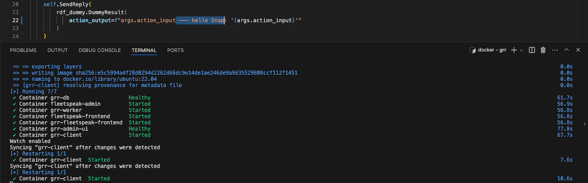

## Step 5. Codelabs

In case you are not ready yet to do your own coding you can run through one of our codelabs to familiarise yourself with the GRR code base.

Either point your browser to [http://localhost:9090](http://localhost:9090) in case you are running the IDE container on your computer or by typing ```http://localhost:9090``` into the Terminal Panel and then ```Ctrl Click``` on it.

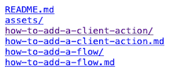

- Choose either of the ```how-to-add…``` links (without the ```.md```) to select the respective Codelab you want to run.

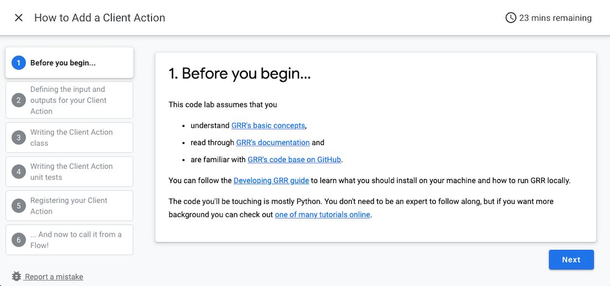

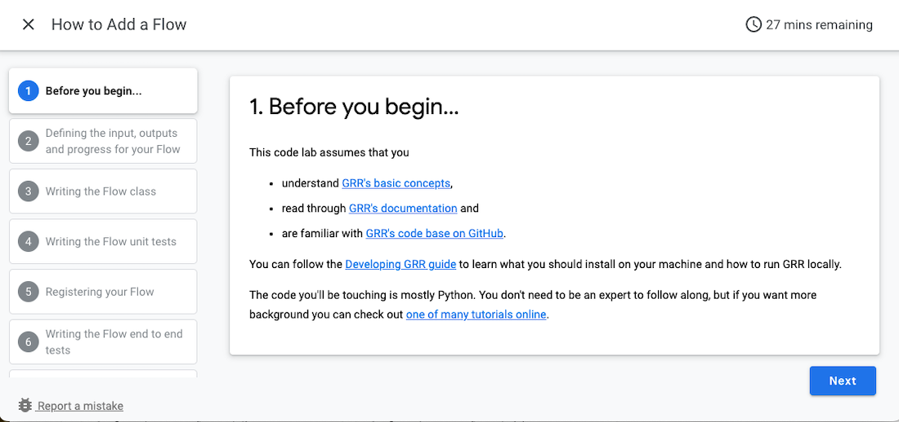

You can also add/adjust your own codelabs. Refer to the [codelabs documentation](./codelabs/index.md) for more info.

## Step 6. Database

In case you would like to access the GRR and Fleetspeak databases you can do so by clicking on the Database icon in the left hand side navigation bar (second icon from the bottom).

You can find the database names and access credentials in the following file: [https://github.com/google/grr/blob/master/docker_config_files/mysql/.env](https://github.com/google/grr/blob/master/docker_config_files/mysql/.env)

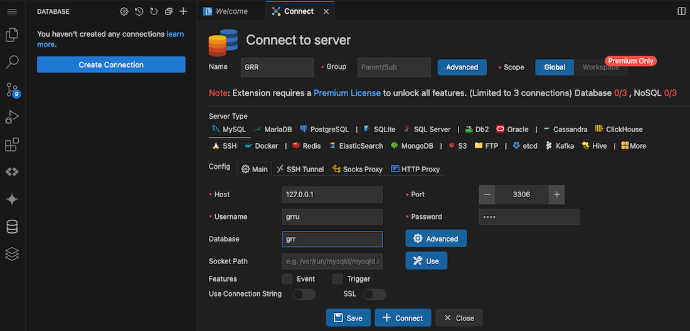

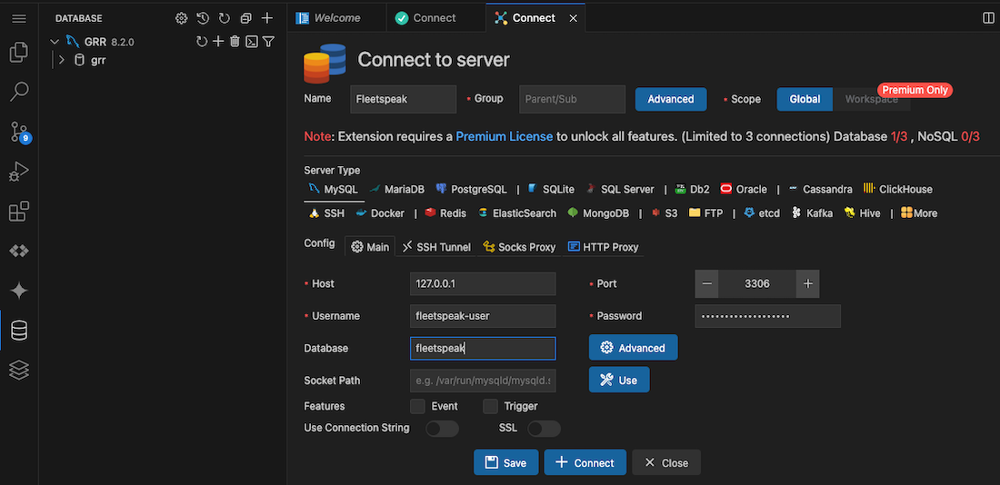
