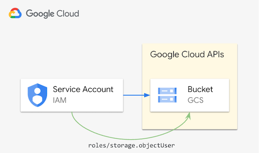
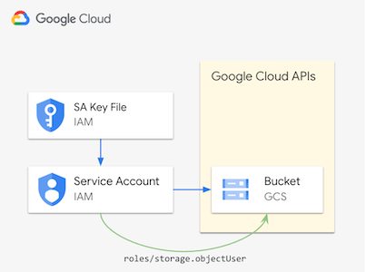
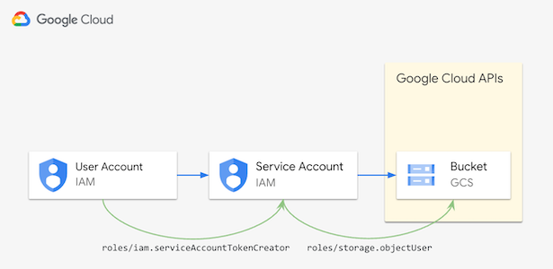
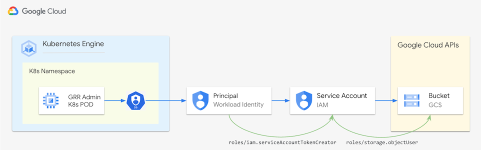

# Collect Large File

The Collect Large File flow is used to upload a potentially large file to the [Google Cloud Storage](https://cloud.google.com/storage/docs/introduction)(GCS). A [signed URL](https://cloud.google.com/storage/docs/access-control/signed-urls) needs to be provided, to which the file will be uploaded.
The flow returns a [session URL](https://cloud.google.com/storage/docs/resumable-uploads#session-uris) which can be used to monitor or [cancel](https://cloud.google.com/storage/docs/performing-resumable-uploads#cancel-upload) the upload.


## Decrypting the file

The uploaded file is encrypted and can be decrypted using the Python API:
```python
from grr_api_client import api

grrapi.Client("C.ABCDEF0123456789").Flow("0123456789ABCDEF").Get().DecryptLargeFile(
        input_path="encrypted_file", output_path="decrypted_file")
```

or the [command line API shell](https://github.com/google/grr/tree/master/api_client/python#using-command-line-api-shell):
```bash
gsutil cat gs://bucket/encrypted_file | \
grr_api_shell --basic_auth_username "user" --basic_auth_password "pwd" \
    --exec_code 'grrapi.Client("C.1234567890ABCDEF").Flow("F:BB628B23").Get().DecryptLargeFile()' \
    http://localhost:1234 > decrypted_file
```

## Note

This flow cannot run as fleet collection.

## Signed URLs for Google Cloud Storage

[Signed URLs](https://cloud.google.com/storage/docs/access-control/signed-urls) give time-limited access to a specific Cloud Storage resource. Anyone in possession of the signed URL can use it (while it's active) regardless of whether they have a Google identity or not.
This section provides more background on how to create and use signed URLs for Google Cloud Storage to collect large files with GRR.

While signed URLs can be used to interact with Google Cloud Storage in different fashions we will limit our discussions to [resumable uploads](https://cloud.google.com/storage/docs/access-control/signed-urls#signing-resumable).

As mentioned, signed URLs can be used by anyone who has got them in their possession, even without having a Google identity.
However, creating signed URLs requires a Google identity (referred to as a [principal](https://cloud.google.com/iam/docs/overview#concepts_related_identity)) which in most cases will be a [Service Account](https://cloud.google.com/iam/docs/service-account-overview) with the appropriate [Identity and Access Management](https://cloud.google.com/iam/docs/overview)(IAM) [permissions](https://cloud.google.com/iam/docs/overview#permissions).




### Required Permissions

Google Cloud allocates [permissions](https://cloud.google.com/iam/docs/overview#permissions) to [principals](https://cloud.google.com/iam/docs/overview#concepts_related_identity) via [roles](https://cloud.google.com/iam/docs/overview#roles). Roles are bundles of permissions. In our case we will use [predefined roles for Cloud Storage](https://cloud.google.com/storage/docs/access-control/iam-roles).

  - To create signed URLs in the simplest case (depicted above) you will need a [Service Account](https://cloud.google.com/iam/docs/service-account-overview) (the principal) with the [Storage Object User](https://cloud.google.com/iam/docs/understanding-roles#storage.objectUser) (```roles/storage.objectUser```) (predefined) role on the [Google Cloud Storage Bucket](https://cloud.google.com/storage/docs/creating-buckets) into which you want to upload the collected files. Assuming you have already downloaded the [Service Account key](https://cloud.google.com/iam/docs/keys-create-delete) then you can create a signed URL by running the command listed below.

```bash
gcloud storage sign-url gs://BUCKET_NAME/OBJECT_NAME --http-verb=POST --headers=x-goog-resumable=start,content-type=application/octet-stream  --region=${GOOGLE_CLOUD_REGION} --duration=1h --private-key-file=/PATH/TO/KEY_FILE
```



  - Note that creating and downloading Service Account keys is [not considered good practice](https://cloud.google.com/iam/docs/best-practices-for-managing-service-account-keys) and should be avoided to use IAM securly following Google's recommended [least privilege](https://cloud.google.com/iam/docs/using-iam-securely#least_privilege) approach. With that in mind you can avoid downloading Service Account keys by leveraging the elegant concept of [Service Account Impersonation](https://cloud.google.com/docs/authentication/use-service-account-impersonation). As the name suggests this will allow your (authenticated) Google identity to act on behalf of the impersonated Service Account. To be able to do so you will need the [Service Account Token Creator](https://cloud.google.com/iam/docs/understanding-roles#iam.serviceAccountTokenCreator) (```roles/iam.serviceAccountTokenCreator```) role on the Service Account in question. With that in place you can create a signed URL by running the command listed below without needing a Service Account key.

```bash
gcloud storage sign-url gs:/${BUCKET_NAME}/${OBJECT_NAME} --http-verb=POST --headers=x-goog-resumable=start,content-type=application/octet-stream --region=${GOOGLE_CLOUD_REGION} --duration=1h  --impersonate-service-account=${SERVICE_ACCOUNT_NAME}@${PROJECT_ID}.iam.gserviceaccount.com
```



  - Assuming you are running GRR on [Google Kubernetes Engine](https://cloud.google.com/kubernetes-engine/docs/concepts/kubernetes-engine-overview)(GKE) you can take the convenience to the next level with letting the [Kubernetes Pod](https://kubernetes.io/docs/concepts/workloads/pods/) that runs the [GRR Admin component](https://grr-doc.readthedocs.io/en/v3.2.1/installing-grr-server/overview.html#web-ui) (a.k.a. GRR Web UI) create the signed URLs in an automated fashion. For this to work you can combine the concept of [Service Account Impersonation](https://cloud.google.com/docs/authentication/use-service-account-impersonation) with that of [Workload Identity Federation for GKE](https://cloud.google.com/kubernetes-engine/docs/concepts/workload-identity). In plain English, [what Workload Identity Federation for GKE](https://cloud.google.com/kubernetes-engine/docs/concepts/workload-identity#what_is) is allowing us to do is to grant Kubernetes workloads (i.e. the GRR Admin component Pod) in your GKE cluster access to specific Google Cloud resources (like the above Service Account). You can find a sample implementation using these concepts in the [OSDFIR Infrastructure Repository](https://github.com/daschwanden/osdfir-infrastructure/blob/main/charts/grr/README.md#2-installing-grr-on-cloud) and more details on this [OSDFIR blog post](https://osdfir.blogspot.com/2024/07/grr-with-gcs-blobstore-and-cloud-pubsub.html).


